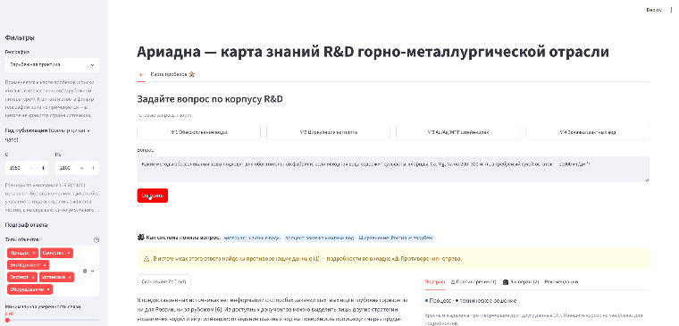

# Ариадна — граф знаний R&D горно-металлургической отрасли

GraphRAG-система: извлекает сущности и связи из корпуса научно-технических
документов (статьи, обзоры, доклады; RU/EN), строит граф знаний в Neo4j и
отвечает на вопросы на естественном языке — с числовыми ограничениями,
географией, временными рамками и ссылками на исходный фрагмент документа.
Работает полностью локально: Neo4j + модели Qwen через Ollama, без внешних API.



## Возможности

- Чат: вопрос → ответ с нумерованными источниками; 4 предзаданных вопроса
  отвечаются из кэша мгновенно, произвольные — живым синтезом локальной LLM.
- Разбор вопроса детерминированным роутером: материал, процесс, числовые
  условия («сульфаты ≤ 300 мг/л»), география, период, сравнительный режим
  «Россия vs зарубеж». Без LLM, по правилам.
- Подграф ответа: интерактивная схема связанных объектов (8 типов онтологии),
  противоречащие факты выделены красным и не скрываются никакими фильтрами.
- Карточки источников: авторы, география (🇷🇺/🌍), цитата, скачивание исходного
  документа.
- Эксперты и организации по теме ответа; рекомендации — похожие кейсы и
  смежные темы.
- Карта пробелов: комбинации «материал × процесс» без источников в корпусе +
  списки тем, встречающихся только в отечественной (44) или только в
  зарубежной (225) литературе.
- Экспорт ответа и карты пробелов в Markdown.
- Ручная правка графа экспертом: поля `confidence`, `updated_at`, `edited_by`
  на узлах и связях; правится в Neo4j Browser (`http://localhost:7474`).
- Провенанс каждого факта и цитаты — до фрагмента исходного документа
  (`doc_id`/`chunk_id`).
- Фильтры интерфейса: география, год публикации, типы объектов, порог
  уверенности связей, размер схемы. Применяются к уже загруженным данным,
  без повторных запросов к базе.

## Параметры системы

| Показатель | Значение |
|---|---|
| Документов обработано | 177 |
| Фрагментов текста | 9 580 |
| Каталожных карточек неиндексированной части корпуса | 86 |
| Сущностей в графе | 23 600+ |
| Связей в графе | 25 063 |
| Числовых ограничений (извлечены правилами) | 8 179 |
| Документов с гео-разметкой | 175 / 177 (ru 65 / foreign 56 / global 54) |
| Ответ из кэша | < 1 с |
| Живой синтез ответа | 24–480 с |
| Тесты | 667 passed + 3 xfail |

## Требования

- Docker + docker compose, для GPU — nvidia-container-toolkit
  (`docker run --gpus all ... nvidia-smi` должен отработать).
- Python 3.11+, зависимости — `pip install -e .` в виртуальное окружение `.venv`.
- Диск: модели Ollama ~25 ГБ (qwen3.5:35b-a3b int4 ~24 ГБ +
  qwen3-embedding:0.6b ~0.6 ГБ), корпус ~5 ГБ.
- Память: референсное железо — DGX Spark (ARM64, GB10, ~120 ГБ unified memory);
  для облегчённого варианта извлечения есть откат на qwen3.5:9b (~6 ГБ).
- Корпус документов (не в репозитории): https://disk.yandex.ru/d/npigiuw4Rbe9Pg —
  распаковать в `data/`.

## Запуск

### Инфраструктура

```bash
cp .env.example .env   # заполнить NEO4J_PASSWORD, при необходимости сдвинуть порты

# .env в корне, compose-файл в deploy/ — поэтому явный --env-file обязателен
alias dc='docker compose --env-file .env -f deploy/docker-compose.yml'

dc up -d               # Neo4j + Ollama
watch dc ps            # дождаться healthy у обоих сервисов

# модели (не входят в образ)
dc exec ollama ollama pull qwen3.5:35b-a3b       # извлечение/синтез, int4
dc exec ollama ollama pull qwen3-embedding:0.6b  # эмбеддинги
dc exec ollama ollama pull qwen3.5:9b            # опционально: облегчённый откат

# проверка
curl -s http://localhost:${NEO4J_HTTP_PORT:-7474} >/dev/null && echo "neo4j OK"
curl -s http://localhost:${OLLAMA_PORT:-11434}/api/tags
```

Пароль Neo4j применяется только при первой инициализации тома `neo4j_data`.
Смена `NEO4J_PASSWORD` в `.env` после первого запуска не меняет пароль в базе —
контейнер будет падать по healthcheck с "unauthorized". Лечение:
`docker volume rm ariadna_neo4j_data` (граф будет потерян) либо смена пароля
через `cypher-shell`: `ALTER CURRENT USER SET PASSWORD FROM 'старый' TO 'новый'`.

В compose есть запаркованный профиль `vllm` (`dc --profile vllm up -d vllm`) —
образ `v0.18.0-cu130` на GB10 не стартует (cuda capability 12.1 > 12.0 в
PyTorch образа), нужен более свежий тег.

### Демо-интерфейс

```bash
.venv/bin/python -m streamlit run ui/app.py
# браузер: http://localhost:8501
```

Вкладка «Чат» — 4 пресета отвечают из кэша `data/processed/answer_cache.json`;
произвольный вопрос уходит в живой синтез (24–480 с). Вкладка
«Карта пробелов ⭐» строится по графу (~15–30 с, затем кэшируется).

### Пайплайн end-to-end

Порядок соответствует потоку данных. База в поставке уже наполнена — полный
прогон нужен для воспроизведения с нуля или на новом корпусе.

```bash
# 1. конвертация корпуса в текст + чанкинг
#    вход: data/Обзоры|Статьи|Доклады/*  выход: data/processed/{meta,texts,chunks,skipped}.jsonl
.venv/bin/python -m ariadna.ingest.pipeline

# 2. отбор ядра документов (флаг is_core в meta.jsonl, пишет targets.jsonl)
.venv/bin/python -m ariadna.ingest.select

# 3. гео-разметка документов правилами → data/processed/doc_geography.jsonl
.venv/bin/python -m ariadna.ingest.geo_classify [--meta-path PATH] [--chunks-path PATH] [--output PATH] [--json]

# 4. эмбеддинги чанков (Ollama) → chunks_embedded.jsonl
.venv/bin/python -m ariadna.search.embeddings

# 5. лексический граф Document→Chunk + vector index в Neo4j
.venv/bin/python -m ariadna.graph.lexical_loader [--meta-path PATH] [--chunks-path PATH] [--limit N]

# 6. LLM-извлечение сущностей/связей по онтологии → extracted.jsonl
#    числа и единицы извлекаются правилами, не LLM
.venv/bin/python -m ariadna.extraction.llm_extract [--limit N] [--targets data/processed/targets.jsonl] [--workers N]

# 7. загрузка сущностного графа (8 типов узлов / 6 типов связей) в Neo4j
#    при прогоне с нуля указывать --input явно (дефолт указывает на
#    исторический файл текущей поставки базы)
.venv/bin/python -m ariadna.graph.entity_loader --input data/processed/extracted.jsonl [--meta-path PATH] [--limit N]

# 8. загрузка гео-разметки (Document.geography)
.venv/bin/python -m ariadna.graph.doc_geography_loader --input data/processed/doc_geography.jsonl

# 9. каталожные карточки неиндексированной части корпуса (CatalogEntry)
.venv/bin/python -m ariadna.ingest.catalog [--dry-run] [--no-load]

# 10. карта пробелов (CLI-печать; UI зовёт ту же функцию напрямую)
.venv/bin/python -m ariadna.analytics.gap_map [--limit N] [--json]

# 11. синтез одного ответа из консоли
.venv/bin/python -m ariadna.search.answer "Вопрос на русском" [--top-k N]
```

## Структура репозитория

```
src/ariadna/
  ingest/       конвертация документов в текст, отбор ядра, гео-разметка, каталог
  extraction/   LLM-извлечение, правила чисел/единиц, синонимия RU/EN
  graph/        онтология, загрузка в Neo4j, шаблоны Cypher
  search/       ретриверы, роутер запросов, синтез ответов
  analytics/    карта пробелов, рекомендации
  api/          FastAPI-бэкенд
ui/             Streamlit-интерфейс
ontology/       OWL-онтология, словарь синонимов RU/EN
config/         конфигурация пайплайна
scripts/        скрипты этапов пайплайна
deploy/         docker-compose (Neo4j + Ollama)
tests/          тесты
data/           корпус и производные (не в git)
```

## Тесты

```bash
pytest tests/
```

Единый прогон всей директории: 667 passed + 3 xfail.

## Ограничения

- Живой синтез ответа локальной LLM — 24–480 с в зависимости от загрузки
  Ollama; предзаданные вопросы отвечаются из кэша.
- Сущностный граф построен по ядру корпуса (~180 документов: обзоры, статьи,
  доклады); журнальные подшивки и материалы конференций — только в каталожном
  слое и векторном индексе.
- 2 документа из 177 без гео-разметки (методички без привязки к практике).
- Произвольный text2cypher не реализован (осознанно): запросы к графу идут
  по фиксированным Cypher-шаблонам со слотами.

## Стек

Neo4j (граф + vector index) · Qwen3.5-35B-A3B через Ollama (int4; откат
qwen3.5:9b) · Qwen3-Embedding-0.6B · FastAPI · Streamlit
